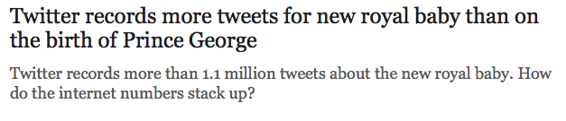
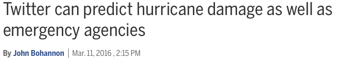
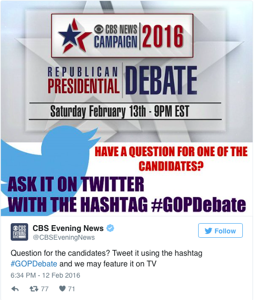

```{r setup, include=FALSE}
knitr::opts_chunk$set(echo = FALSE)
```

## How can statistics inform real-world issues?

- Tank production during WWII
- Code breaking
- Epidemiology

## Recently social media has taken over...
- ...And shown...

## Current Events
<div class="centered">

</div>

## Emergency Events
<div class="centered">

</div>

## It is Even a 'Primary' Form of Communication
<div class="centered">

</div>

## More data, more problems
- Facebook's unethical(?) manipulation of user feeds
  + Is this data public?
  + Can is be considered 'observational research'?
- Big Brother watching?
  + FBI vs. Apple and other tech companies
- Do the benefits outweigh the costs?
  + Matthew Gerber at UVA used twitter data to predict crime

## What we know...
- As Facebook usage increases (Chour and Edge, 2012)
  + Attributions about how fair your life is goes down
  + You perceive others as being happier
- Individuals typically can only identify 72% of their Facebook friends (Croom et al., 2016)
- For men... (Fox and Rooney, 2015)
  + Number of selfies posted predicts trait narcissism and psychopathy
  + Trait narcissism predicts editing of posted selfies
  
## What we know...
- Twitter as a forecasting tool for
  + Crime
  + Severe weather
  + Election predictions (U.K. and Middle East)
  + Movie sales (Asur and Huberman, 2010)

## What we can learn...
- Some work predicting health outcomes from Facebook data
  + Biggest predictor of alcoholism is posting pictures between 2AM - 6AM

## An example is in order...
- Text sentiment analysis
- Twitter scraping with sentiment
- Some brainstorm and discussion


