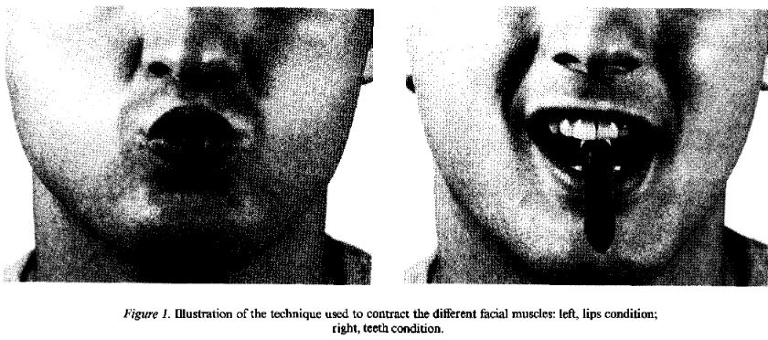
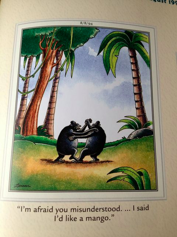
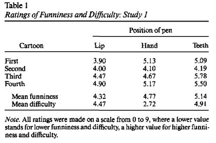
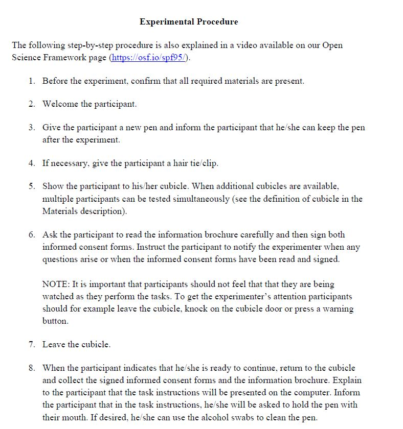

# Facial Feedback Hypothesis
Daniel Albohn  
October 28, 2015  

## Replication Reports
- Recent outcry over crisis in psychology
- Is it an issue?
    + Personal thoughts?
- Open Science Initiative
  
## Strack et al. (1988) Replication Report

- Sponsored by APS
- "Registered Replication Reports consist of multi-lab, high-quality replications of important experiments in psychological science along with comments by the authors of the original studies" (APS, 2015)
- Attempt to replicate the main findings of the Facial Feedback Hypothesis
    + Soussignan (2002)

## The Facial Feedback Hypothesis {.flexbox .vcenter}

## Fake Motor Task 1 {.flexbox .vcenter}

## Fake Motor Task 2 {.flexbox .vcenter}

## Cartoon Rating {.flexbox .vcenter}

## Cartoon Rating {.flexbox .vcenter}

## The Facial Feedback Hypothesis
- When smiling behavior is facilitated...
    + Cartoons rated as most humerous
- When smiling behavior is inhibited...
    + Cartoons rated least humerous

## The Facial Feedback Hypothesis

## Strack RRR Procedure
- Very systematic
    + 24 steps detailing how to interact/run/exclude participants
- Specific data format for recording data (similar to what we already do)
- Video explaining the process

## Instructions

## Additional Moderators and Mediators
- The Duchenne smile
    + i.e., Soussignan (2002)
- Type of humor
    + e.g., Coping humor
- Respiratory sinus arrhythmia (RSA)
    + Higher RSA linked to higher social functioning

## Video
- Watch it!
