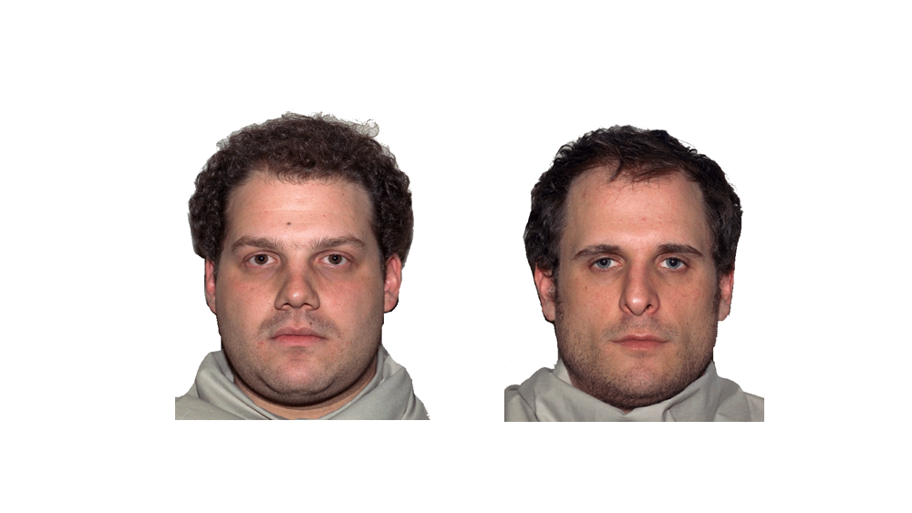
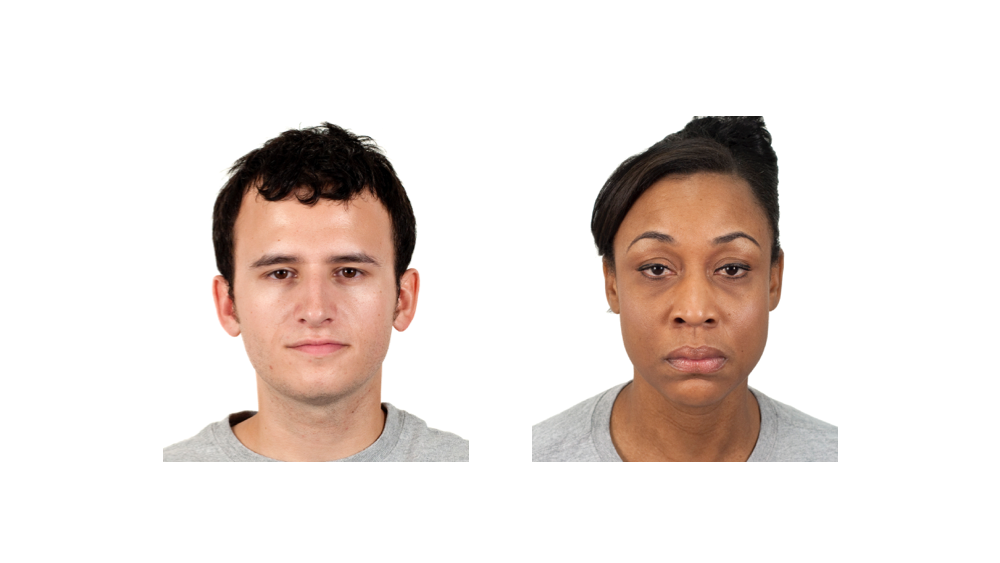
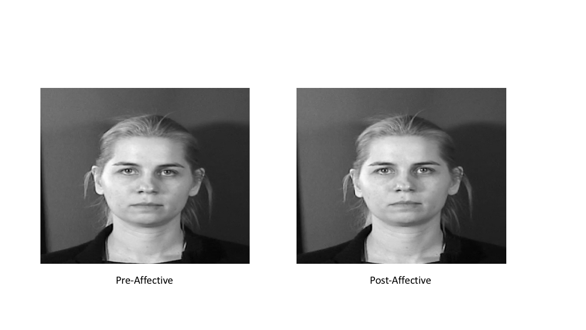

## What's in a Neutral Face?

## What's in a Neutral Face?

## What's in a Neutral Face?

## What's in a Neutral Face?

## What's in a Neutral Face?

## Why Study Neutral?

- Prototypical expressions are not the norm
    + [Hess et al., 2009](http://dx.doi.org/10.1037/a0013386), [Russell, 1994](http://dx.doi.org/10.1037/0033-2909.115.1.102)
- Neutral has not be studied extensively
    + [Russell & Fehr, 1987](http://dx.doi.org/10.1037/0096-3445.116.3.223)
    + [Neth and Martinez, 2009](http://dx.doi.org/10.1167/9.1.5)
    + [Lee et al., 2008](http://dx.doi.org/10.1016/j.psychres.2007.02.005)

## How to Study Neutral?

- Face Ratings
    + Pre- vs post-neutral displays
    
## How to Study Neutral

## How to Study Neutral

## How to Study Neutral

## Reverse Correlation
 - An implicit measure
 - "Mental representation"
 
## Reverse Correlation

[[Dotch et al.,2008]](http://dx.doi.org/10.1111/j.1467-9280.2008.02186.x)

## Mental Represenation of Neutral

## Mental Represenation of Neutral

## Ratings are not Neutral

## Elderly Neutral Faces

## Gay/Straight Neutral Faces

## Baby Neutral Faces

